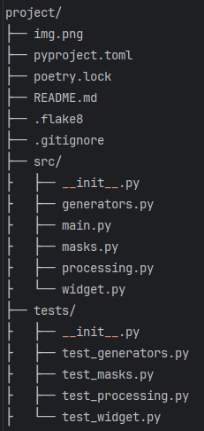

# Проект "domashka_kurs"

## Описание:

Проект "domashka_kurs" - это приложение на Python для выполнения домашней работы в ходе прохождения курса по изучению
языка программирования Python.

## Предварительные требования

* Python 3.8 или выше
* Git
* Poetry (рекомендуется) или pip

## Установка с помощью Poetry:

project/
├── img.png
├── pyproject.toml
├── poetry.lock
├── README.md
├── .flake8
├── .gitignore
├── src/
├ ├── __init__.py        
├ ├── generators.py       
├ ├── main.py           
├ ├── masks.py           
├ ├── processing.py     
├ └── widget.py      
├── tests/
├ ├── __init__.py        
├ ├── test_generators.py       
├ ├── test_masks.py           
├ ├── test_processing.py     
├ └── test_widget.py

1. Клонируйте репозиторий:

```
git clone git@github.com:BelSergey/domashka_kurs.git
```

2. Установить зависимости через Poetry

```
poetry install
```

3. Активировать виртуальное окружение

```
poetry shell
```

# Структура проекта



# Описание модулей
# src\utils
## json_data_extractor 

    Содержит:
- функцию извлечения данных о транзакциях из json- файла transaction_data_extractor(file_path: str) -> List[Dict[str, Any]]:

## simple_calculator
Содержит:
- класс Calculator с функциями сложения, вычитания, умножения и деления целых чисел  
# src/
## masks.py

Содержит:

- функцию для маскировки банковских карт `get_mask_card_number(card_number: str) -> str`
- функцию для маскировки банковских счетов `get_mask_account(account_number: str) -> str`

## widget.py

Содержит:

- функцию `mask_account_card(incoming_string: str) -> str`, которая маскирует номера карт и счетов
- функцию `get_date(date_string: str) -> str`, которая форматирует дату

## processing.py

Содержит:

- функцию `filter_by_state(operations: List[Dict], state: str = "EXECUTED") -> List[Dict]`
- функцию `sort_by_date(operations: List[Dict], reverse: bool = True) -> List[Dict]`

## generators.py

Содержит:

- функцию `filter_by_currency(transactions: List[Dict], currency_code: str) -> Iterator[Dict]`,
  которая возвращает итератор по транзакциям с заданной валютой.
- генератор transaction_descriptions(transactions: List[Dict]) -> Iterator[str]
  , который возвращает описания транзакций по очереди.
- генератор card_number_generator(start: int, end: int) -> Iterator[str]
  , который генерирует номера карт в формате "XXXX XXXX XXXX XXXX" в заданном диапазоне.
## decorators.py

Содержит:

- декоратор `log(func: Optional[Callable] = None, filename: Optional[str] = None) -> Union[Callable, Callable[[Callable], Callable]]:для логирования вызовов функций
- вспомогательную функцию write_log(message: str, filename: Optional[str] = None) -> None:,
 которая записывает логи в файл или выводит в консоль

## external_api

Содержит:

- функцию конвертации суммы транзакции в рубли, используя Exchange Rates Data API, get_amount_in_rub(transaction: Dict) -> Optional[float]
# Тестирование:

Установите `pytest` и `pytest-cov`:

```
poetry add pytest pytest-cov
````

Для запуска тестирования с проверкой покрытия выполните команду:

```
poetry run pytest tests/ -v --cov=src
```

Для запуска тестирования без проверки покрытия выполните команду:

```
poetry run pytest tests/
```

## Документация:

[Документация](https://github.com/BelSergey/domashka_kurs/blob/master/README.md).

